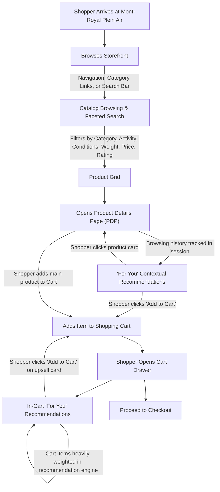

# Product Requirements Document (PRD)
# Mont-Royal Plein Air – On-Device Recommendation Engine Demo

**Project:** Mont-Royal Plein Air (Developer Workshop Sample Codebase)  
**Milestone:** Phase 1 – Product Requirements Document (UX & Flow)  
**Status:** In Review (Approval Requested)  

---

## 1. Purpose & Educational Concept

**Mont-Royal Plein Air** is a clean, responsive sample e-commerce application designed specifically as a hands-on learning demo for web developers.

The goal of this application is to demonstrate how **on-device language models (Chrome Built-in AI / Prompt API)** can power an intelligent, proactive recommendation engine based on a user's active browsing journey and shopping cart.

### 1.1 Why AI-Powered Recommendations? (Moving Beyond Database Lookups)
Traditional e-commerce stores rely on static relational database queries (e.g. looking up explicit foreign keys like "Tent X → Footprint Y", or filtering matching brand/category tags).

This demo showcases what **generative AI uniquely excels at**:
* **Semantic Intent & Activity Synthesis:** Identifying implicit outdoor pursuits across disparate browsing steps (e.g., recognizing that viewing an ultralight bivy, running gaiters, and compact water filters indicates an *ultralight fastpacking* trip, without hardcoded lookup tables).
* **Cross-Category Thematic Pairings:** Proactively surfacing gear across unrelated categories that share the same environmental demands, weight philosophy, or weather requirements.
* **Holistic Cart Evaluation:** Analyzing the complete basket in the shopping cart with heavy weighting to suggest cohesive, complementary gear.
* **Developer Explainability (Native Chrome Console):** Emitting structured reasoning traces directly to the native browser developer console (`console.log` / `console.group`) so workshop attendees can inspect and understand the model's decision-making process in Chrome DevTools without cluttering the user interface.

---

## 2. Generic Recommendation Engine & Illustrative Test Scenarios

> [!IMPORTANT]
> The recommendation engine is designed as a **generic, domain-wide semantic synthesis solution**. It is not hardcoded to specific rules or fixed product pairs. The test scenarios below serve as representative examples that any generic context-synthesis implementation must handle accurately.

| Test Scenario (Generic Input) | Browsing & Cart Context | Expected Generic Recommendation Behavior |
| :--- | :--- | :--- |
| **Fastpacking / Ultralight Trail** | Shopper views trail running shoes, sub-1.3kg tents, and carbon trekking poles. | Synthesizes an ultralight, high-tempo trail intent. Proactively recommends packable wind vests, lightweight squeeze filters, and titanium tableware, prioritizing gram savings and compact packability. |
| **Sub-Zero Alpine Mountaineering** | Shopper views 4-season tents, sub-zero sleeping bags, and insulated leather mountaineering gloves. | Identifies severe winter and sub-zero conditions. Proactively recommends high R-value insulated pads, thermal face gaiters, and electronic hand warmers to mitigate extreme cold heat loss. |
| **Paddling & Canoe Tripping** | Shopper views 20L heavy-duty dry bags, synthetic sleeping bags, and amphibious river sandals. | Identifies water immersion, wet conditions, and high-humidity demands. Recommends waterproof floating cases, high-power headlamps, and packable camp cookware suited for canoe portages. |

---

## 3. Shopper Journey & User Flows

### 3.1 Flow 1: Catalog Exploration & Search
1. Shoppers discover products through standard browsing navigation, keyword search via the header search bar, or faceted filtering.
2. **Faceted Filtering:** Shoppers can narrow product listings in the sidebar by clean standard dimensions:
   * **Category:** Tents, Sleeping Bags, Backpacks, Apparel, Footwear, Camp Kitchen, Lighting, Safety.
   * **Activity:** Hiking, Backpacking, Camping, Trail Running, Mountaineering, Paddling.
   * **Conditions (Multi-Select):** Sub-Zero, Cold, Mild, Hot, Rain / Wet, Snow / Ice, Wind, Dry.
   * **Weight:** `< 500g`, `500g – 1kg`, `1kg – 2kg`, `> 2kg`.
   * **Price:** `< $50`, `$50 – $100`, `$100 – $250`, `$250+`.
   * **Rating:** 3+, 4+, 5.

### 3.2 Flow 2: Journey-Aware Contextual Recommendations ("For You")
1. As the shopper navigates between products, the application maintains active session context (chronological sequence of viewed products and time spent).
2. On product detail pages, a **"For You"** section proactively displays 2–4 recommended items.
3. Recommendations surface conceptually aligned gear across different categories based on the user's active trail of interest and environmental conditions.
4. Each recommendation card features a standard product card with an **"Add to Cart"** button. No visual AI badges or explanation clutter in the shopper UI.

### 3.3 Flow 3: In-Cart Recommendations & Basket Synthesis ("For You")
1. When the shopper opens the Cart Drawer, the recommendation engine evaluates the active basket.
2. **Context Weighting:** Cart items are given **significantly higher weighting** than passive browsing history to reflect committed purchase intent.
3. An in-cart tray titled **"For You"** displays 1–3 high-synergy recommendations.
4. Clicking **"Add to Cart"** immediately adds the item to the active order with live cart total recalculation.

### 3.4 Developer Flow: Structured Native Console Traces
* The recommendation engine logs structured diagnostic traces directly to the native browser developer console (`console.log` / `console.group`).
* Workshop attendees can open Chrome DevTools (F12 / Cmd+Opt+I) to inspect:
  * Raw contextual inputs (browsing trail + weighted cart items).
  * Prompt API invocation parameters.
  * Extracted journey theme / activity archetype / environmental conditions.
  * Structured rationale for each recommended product ID.

---

## 4. Stretch Goals (Educational Extensions for Attendees)

These stretch goals represent advanced on-device AI capabilities that workshop attendees can explore:

### 4.1 Stretch Goal 1: Natural Language Adventure Prompt ("Describe Your Adventure")
* An optional conversational input bar (e.g. accessible via search or an adventure banner) allowing shoppers to type freeform natural language trip plans (e.g., *"3-day autumn bikepacking trip in the Eastern Townships with forecasted freezing rain"*).
* When entered, this unstructured context is synthesized by the Prompt API alongside browsing history to dynamically calibrate recommendations.

### 4.2 Stretch Goal 2: On-Device Real-Time Translation API
* Demonstrates Chrome's Built-in **Translation API** (`https://developer.chrome.com/docs/ai/translator-api`).
* A language selector in the header allows users to dynamically translate product catalog descriptions, technical specifications, and UI content entirely client-side, on-device, and offline into their preferred language (e.g., French, Spanish, Japanese, German) without server egress.

---

## 5. User Experience & Screen Layout Requirements

### 5.1 Header & Navigation
* **Brand Identity:** "Mont-Royal Plein Air" logo and main category navigation.
* **Search Bar:** Standard text search bar with placeholder (*"Search gear, clothing, conditions..."*).
* **Stretch Goal Controls:** Language/Translation switcher button (Translation API) and "Describe Your Adventure" prompt trigger.
* **Cart Button:** Header badge displaying live item count and subtotal.

### 5.2 Faceted Catalog View
* **Sidebar Facets:**
  * **Category:** Tents, Sleeping Bags, Backpacks, Apparel, Footwear, Camp Kitchen, Lighting, Safety.
  * **Activity:** Hiking, Backpacking, Camping, Trail Running, Mountaineering, Paddling.
  * **Conditions:** Sub-Zero, Cold, Mild, Hot, Rain / Wet, Snow / Ice, Wind, Dry.
  * **Weight:** `< 500g`, `500g – 1kg`, `1kg – 2kg`, `> 2kg`.
  * **Price:** `< $50`, `$50 – $100`, `$100 – $250`, `$250+`.
  * **Rating:** 3+, 4+, 5.
* **Product Grid:** Responsive product cards with thumbnail image, product name, category, price, rating stars, weight tag, condition tags, and "+ Cart" button.

### 5.3 Product Detail Page (PDP)
* **Functional Breadcrumbs:** Clickable links (e.g., `Home > Sleeping Bags > Mountaineering`) that navigate and filter appropriately.
* **Main Product Area:** Product photo gallery, title, price, star ratings, narrative description, key features list, and full technical specifications table.
* **"For You" Section:** Clean horizontal product cards titled simply **"For You"** with direct "+ Cart" actions. No visual AI badges or explanation clutter.

### 5.4 Slide-Out Cart Drawer
* **Cart Items List:** Thumbnail, title, unit price, quantity controls (`-` / `+`), and delete button.
* **In-Cart "For You" Section:** Titled simply **"For You"** with 1-click "+ Cart" buttons.
* **Order Summary:** Subtotal, estimated taxes, shipping estimate, and Checkout button.

---

## 6. Store Product Catalog (75 Generated Outdoor Items)

The catalog comprises **75 curated items** across **8 outdoor categories** with English content and realistic specifications:

| ID | Product Name | Category | Activity | Composable Conditions | Weight | Price | Key Characteristics & Specifications |
| :--- | :--- | :--- | :--- | :--- | :--- | :--- | :--- |
| `tent-mont-tremblant-3p` | Mont-Tremblant 3-Season Expedition Tent | Tents | Backpacking | Rain / Wet, Wind, Cold | 2.15 kg | $349.99 | 3-Person, 2.15kg double-wall ripstop shelter with DAC Featherlite poles and 3000mm waterproofing. |
| `tent-gaspesie-ultralight-2p` | Gaspésie Ultralight 2P Backpacking Tent | Tents | Backpacking | Mild, Wind, Rain / Wet | 1.28 kg | $289.99 | Sub-1.3kg freestanding 2-person tent engineered for long-distance thru-hiking and alpine ridges. |
| `tent-laurentian-family-4p` | Laurentian 4-Person Basecamp Tent | Tents | Camping | Mild, Dry | 6.80 kg | $429.99 | Stand-up height (185cm) 4-person tent with large screen porch vestibule for family camping. |
| `tarp-borealis-silnylon` | Borealis Ultralight Silnylon Camp Tarp (3x3m) | Tents | Backpacking | Rain / Wet, Wind | 480 g | $89.99 | 480g 30D silicone-coated square tarp with 16 tie-outs for ultralight minimalist bivouacs. |
| `footprint-mont-tremblant-3p` | Mont-Tremblant 3P Custom Fitted Footprint | Tents | Backpacking | Rain / Wet, Cold | 280 g | $39.99 | 70D protective groundsheet cut to protect tent floors from abrasive granite and damp ground. |
| `footprint-gaspesie-2p` | Gaspésie 2P Ultralight Tent Groundsheet | Tents | Backpacking | Mild, Rain / Wet | 190 g | $34.99 | 190g fitted ultralight groundsheet tailored specifically for the Gaspésie 2P tent. |
| `sleepbag-taiga-down-minus10` | Taiga 800-Fill Down Sleeping Bag (-10°C) | Sleeping Bags | Mountaineering | Sub-Zero, Snow / Ice | 1.05 kg | $299.99 | Sub-zero RDS water-repellent down mummy bag for late-fall and winter alpine expeditions. |
| `sleepbag-summit-synthetic-0` | Summit Synthetic 3-Season Bag (0°C) | Sleeping Bags | Paddling | Cold, Rain / Wet | 1.32 kg | $159.99 | High-loft synthetic hollow-fiber mummy bag that maintains warmth in damp canoe trips. |
| `sleepbag-solstice-summer-plus10` | Solstice Ultralight Summer Bag (+10°C) | Sleeping Bags | Backpacking | Hot, Mild, Dry | 650 g | $119.99 | 650g ultracompact summer bag that unzips flat into a warm-weather camp quilt. |
| `pad-laurentian-thermal-insulated` | Laurentian Air Thermal Sleeping Pad (R-4.8) | Sleeping Bags | Mountaineering | Sub-Zero, Cold, Snow / Ice | 540 g | $89.99 | 8cm thick insulated air mattress with internal heat-reflective foil barrier (R-Value 4.8). |
| `pad-ultralight-foam-flex` | FlexLite Closed-Cell Foam Camp Mat | Sleeping Bags | Backpacking | Mild, Cold, Dry | 390 g | $34.99 | Accordion-folding 390g puncture-proof EVA foam mat with heat-trapping dimples (R-Value 2.0). |
| `chair-camp-compact-aluminum` | St-Donat Ultralight Folding Camp Chair | Tents | Camping | Mild, Dry | 890 g | $69.99 | 890g shock-corded aluminum camp chair supporting up to 135kg. |
| `pack-expedition-trans-canada-65l` | Trans-Canada 65L Expedition Backpack | Backpacks | Backpacking | Cold, Rain / Wet, Wind | 2.18 kg | $269.99 | Heavy-haul 65L pack with pivoting lumbar hipbelt and bottom sleeping bag compartment. |
| `pack-weekend-chic-chocs-38l` | Chic-Chocs 38L Alpine Trekking Pack | Backpacks | Mountaineering | Cold, Snow / Ice, Wind | 1.15 kg | $179.99 | 38L roll-top alpine pack for weekend overnight trips and technical ridge traverses. |
| `pack-day-mont-royal-18l` | Mont-Royal 18L Summit Daypack | Backpacks | Hiking | Mild, Dry, Rain / Wet | 520 g | $79.99 | 520g sleek daypack with hydration/laptop sleeve and breathable air-mesh back. |
| `vest-trail-marathon-hydration-12l` | Endurance 12L Trail Running Hydration Vest | Backpacks | Trail Running | Hot, Mild, Dry | 225 g | $129.99 | 225g bounce-free running vest with twin 500ml soft flasks included. |
| `drybag-st-lawrence-20l` | St. Lawrence River 20L Heavy-Duty Dry Bag | Backpacks | Paddling | Rain / Wet, Cold | 380 g | $29.99 | IPX7 submersible 500D PVC roll-top dry bag with shoulder sling for canoe rapids. |
| `drybag-ultralight-set-3p` | Pack-Tite Ultralight Dry Bag 3-Pack (5/10/15L) | Backpacks | Backpacking | Rain / Wet, Cold | 108 g | $39.99 | Translucent 30D siliconized Cordura dry sacks for internal backpack organization. |
| `waistpack-trail-lumbar-5l` | Parc du Mont-Royal 5L Lumbar Trail Pack | Backpacks | Trail Running | Mild, Hot, Dry | 310 g | $44.99 | Ergonomic lumbar pack with twin water bottle holsters for fast day hikes. |
| `pack-cover-waterproof-highvis` | Shield-Tech High-Visibility Rain Cover (50-70L)| Backpacks | Backpacking | Rain / Wet, Wind | 115 g | $24.99 | Seamless waterproof ripstop cover with reflective perimeter to shield large packs in storms. |
| `duffel-expedition-waterproof-70l` | Boreal 70L Rugged Waterproof Duffel | Backpacks | Camping | Rain / Wet, Snow / Ice | 1.45 kg | $149.99 | Bombproof 840D TPU expedition duffel with stowable backpack shoulder straps. |
| `organizer-packing-cube-ultralight`| Ultralight Compression Packing Cube Set (3-Pk) | Backpacks | Camping | Mild, Dry | 130 g | $29.99 | Dual-zipper compression cubes that compress apparel volume by up to 40%. |
| `jacket-saguenay-goretex-pro-shell` | Saguenay 3-Layer GORE-TEX Pro Shell Jacket | Apparel | Mountaineering | Rain / Wet, Wind, Cold | 435 g | $399.99 | 28,000mm waterproof alpine storm jacket with underarm pit zips and helmet hood. |
| `jacket-arctic-boreal-down-850` | Arctic Boreal 850-Fill Goose Down Parka | Apparel | Mountaineering | Sub-Zero, Snow / Ice, Wind | 590 g | $349.99 | Sub-zero expedition down parka engineered for severe cold down to -25°C. |
| `fleece-charlevoix-grid-midlayer` | Charlevoix Technical Grid-Fleece Hoody | Apparel | Mountaineering | Cold, Snow / Ice | 315 g | $119.99 | High-mobility breathable grid-fleece midlayer with scuba hood and thumb loops. |
| `baselayer-merino-250-crew` | High-Altitude Merino 250 Thermal Crew Top | Apparel | Mountaineering | Sub-Zero, Cold | 240 g | $94.99 | 100% natural 250g/m² heavyweight merino wool thermal top. Naturally odor-resistant. |
| `baselayer-merino-250-bottom` | High-Altitude Merino 250 Thermal Leggings | Apparel | Mountaineering | Sub-Zero, Cold | 210 g | $89.99 | Heavyweight 250g/m² merino wool thermal long underwear for sub-zero active warmth. |
| `pants-mont-albert-alpine-trek` | Mont-Albert Reinforced Alpine Trekking Pants | Apparel | Mountaineering | Cold, Wind, Snow / Ice | 460 g | $139.99 | 4-way stretch softshell pants reinforced with 500D Cordura knees and boot lace hooks. |
| `pants-storm-waterproof-rain-overpants` | Torrential GORE-TEX Paclite Rain Overpants | Apparel | Backpacking | Rain / Wet, Wind | 270 g | $159.99 | 270g packable waterproof overpants with 3/4 side zippers for fast on/off over boots. |
| `gloves-baffin-insulated-mountaineering` | Baffin Waterproof Insulated Mountaineering Gloves | Apparel | Mountaineering | Sub-Zero, Snow / Ice, Wind | 210 g | $89.99 | Goat leather winter gloves insulated with 170g PrimaLoft Gold for alpine freezing conditions. |
| `gloves-trail-light-windstopper` | WindBlock Touchscreen Trail Gloves | Apparel | Trail Running | Mild, Cold, Wind | 65 g | $39.99 | Form-fitting softshell windproof gloves with conductive touchscreen fingertips. |
| `beanie-nunavik-merino-wool` | Nunavik Double-Layer Merino Wool Beanie | Apparel | Mountaineering | Sub-Zero, Cold, Wind | 75 g | $34.99 | 100% fine merino rib-knit double-cuff toque for maximum ear warmth. |
| `socks-merino-heavy-cushion-trek` | PeakTrek Heavy Cushion Merino Mountaineering Socks | Apparel | Mountaineering | Sub-Zero, Cold, Snow / Ice | 120 g | $27.99 | High-density looped terry merino socks for blister-free comfort in stiff boots. |
| `socks-merino-light-trail-runner` | PeakTrek Light Cushion Merino Running Socks (2-Pk) | Apparel | Trail Running | Hot, Mild, Dry | 60 g | $19.99 | Fast-drying quarter-crew merino running socks with targeted impact cushioning. |
| `vest-windproof-ultralight-running` | Aerolite Ultralight Packable Wind Vest | Apparel | Trail Running | Mild, Wind | 75 g | $79.99 | 75g featherweight wind-blocking core vest with laser-perforated back venting. |
| `neck-gaiter-merino-thermal` | Thermal Merino Wool Neck Gaiter / Buff | Apparel | Mountaineering | Sub-Zero, Cold, Wind | 45 g | $24.99 | Seamless 200g/m² 100% merino wool neck tube for wind and snow protection. |
| `boots-appalachian-mid-waterproof` | Appalachian Waterproof Leather Mid Hiking Boots | Footwear | Backpacking | Rain / Wet, Cold, Snow / Ice | 1.16 kg | $219.99 | Nubuck leather waterproof backpacking boot featuring Vibram Megagrip lugged outsoles. |
| `shoes-laurentian-speed-trail-runner` | Laurentian Speed Vigor Trail Running Shoes | Footwear | Trail Running | Mild, Hot, Dry | 580 g | $149.99 | Aggressive 4.5mm lugged trail runner with protective rock plate and speed lacing. |
| `gaiters-alpine-waterproof-frontpoint` | Frontpoint Breathable Alpine Trail Gaiters | Footwear | Mountaineering | Snow / Ice, Rain / Wet, Cold | 230 g | $49.99 | 1000D Cordura lower gaiters to seal out snow, mud, and scree from hiking boots. |
| `crampons-nordic-ice-traction-spikes` | Nordic Grip Steel Microspikes & Traction Cleats | Footwear | Mountaineering | Sub-Zero, Snow / Ice | 360 g | $64.99 | 12 stainless steel spikes per foot on flexible rubber harness for icy winter trails. |
| `poles-carbon-trekking-ultralight` | Carbon Aero Pro Folding Trekking Poles (Pair) | Footwear | Backpacking | Mild, Cold, Snow / Ice | 395 g | $129.99 | 395g folding 100% carbon fiber poles with natural cork sweat-wicking grips. |
| `shoes-camp-recovery-slide` | Basecamp Thermal Insulated Camp Booties | Footwear | Camping | Cold, Snow / Ice, Dry | 170 g | $54.99 | Cozy insulated slip-on camp booties with non-slip silicone traction sole. |
| `insoles-trail-orthotic-support` | TrailSupport Cushioning Ergonomic Insoles | Footwear | Hiking | Mild, Cold, Hot | 85 g | $34.99 | Deep heel cup and carbon-composite arch support replacement insoles for trail footwear. |
| `sandals-river-hybrid-water` | Rivière All-Terrain Amphibious Hiking Sandals | Footwear | Paddling | Hot, Mild, Rain / Wet | 680 g | $89.99 | Quick-drying webbed amphibious sandals with rubber toe protection and wet-rock grip. |
| `boot-dryer-portable-travel` | Port-a-Dry Compact Boot & Glove Warmer | Footwear | Mountaineering | Cold, Snow / Ice, Rain / Wet | 240 g | $39.99 | Dual USB/12V gentle thermal convection drying pods for soaked boots and gloves. |
| `laces-kevlar-reinforced-hiking` | Kevlar-Core Heavy Duty Boot Laces (Pair) | Footwear | Hiking | Cold, Rain / Wet, Dry | 30 g | $12.99 | Unbreakable 100% Kevlar-reinforced replacement laces rated to 500 lbs tensile strength. |
| `stove-jacques-cartier-ultralight-isobutane` | Jacques-Cartier Ultralight Micro Isobutane Stove | Camp Kitchen | Backpacking | Mild, Hot, Dry | 73 g | $44.99 | 73g pocket-sized titanium screw-on backpacking stove with 10,000 BTU output. |
| `stove-boreal-windmaster-system` | Boreal Windmaster Integrated Fast-Boil Stove System | Camp Kitchen | Mountaineering | Cold, Wind, Sub-Zero | 370 g | $119.99 | 1L flux-ring pot stove system with piezo ignition that boils 500ml in 100 seconds. |
| `fuel-isobutane-canister-230g` | PureBurn 230g Isobutane/Propane Fuel Canister | Camp Kitchen | Backpacking | Cold, Sub-Zero, Mild | 380 g | $7.99 | 4-season 80/20 cold-weather gas blend with universal threaded Lindal valve. |
| `fuel-isobutane-canister-100g` | PureBurn 100g Ultralight Isobutane Canister | Camp Kitchen | Backpacking | Mild, Hot, Dry | 195 g | $5.99 | Compact 100g canister designed to nest inside 750ml titanium mugs and stove sets. |
| `cookset-titanium-pot-pan-combo` | TitanTrek 1100ml Titanium Pot & Skillet Set | Camp Kitchen | Backpacking | Mild, Cold, Hot | 165 g | $64.99 | 165g pure titanium 1.1L pot with lid that doubles as a frying pan/bowl. |
| `mug-double-wall-titanium-450ml` | TitanTrek 450ml Double-Wall Titanium Mug | Camp Kitchen | Camping | Cold, Sub-Zero, Mild | 120 g | $34.99 | Vacuum-insulated titanium camp mug with folding handles; keeps drinks hot for 2 hours. |
| `utensil-titanium-long-handle-spork` | Long-Reach Ultralight Titanium Trail Spork | Camp Kitchen | Backpacking | Mild, Hot, Cold | 19 g | $14.99 | 19g 21.5cm long handle titanium spork designed to reach deep into meal pouches. |
| `filter-rapids-squeeze-water` | Rapids Gravity & Squeeze Micro Water Filter | Camp Kitchen | Backpacking | Mild, Hot, Rain / Wet | 65 g | $42.99 | 65g 0.1-micron hollow-fiber filter removing 99.99999% of bacteria and protozoa. |
| `bottle-insulated-stainless-1l` | GlacierShield 1L Vacuum Insulated Steel Bottle | Camp Kitchen | Hiking | Hot, Cold, Sub-Zero | 420 g | $36.99 | 18/8 stainless steel bottle keeping liquids cold 24h or hot 12h; wide mouth fits filters. |
| `reservoir-hydrapack-3l-bladder` | HydraFlow 3L Leak-Proof Hydration Reservoir | Camp Kitchen | Backpacking | Hot, Mild, Dry | 160 g | $38.99 | Wide slide-seal 3L bladder with insulated quick-disconnect drinking hose. |
| `meal-freeze-dried-montreal-shepherds-pie` | Backcountry Freeze-Dried Pâté Chinois (2-Serv) | Camp Kitchen | Backpacking | Cold, Sub-Zero, Mild | 180 g | $13.99 | Quebec Shepherd's Pie with beef, corn, and mashed potatoes (650 kcal, 36g protein). |
| `meal-freeze-dried-wild-berry-oatmeal` | Backcountry Wild Blueberry & Maple Oats (2-Serv) | Camp Kitchen | Backpacking | Mild, Cold, Hot | 140 g | $9.99 | Organic rolled oats with maple sugar flakes, chia, and wild blueberries (520 kcal). |
| `headlamp-aurora-borealis-500lm` | Aurora Borealis 500-Lumen Rechargeable Headlamp | Lighting | Backpacking | Rain / Wet, Cold, Wind | 78 g | $59.99 | 78g IPX8 waterproof 500lm hybrid headlamp with red night-vision mode and USB-C. |
| `lantern-sol-camping-collapsible` | SolGlow Solar & USB Collapsible Tent Lantern | Lighting | Camping | Hot, Mild, Dry | 165 g | $29.99 | Soft silicone 300-lumen lantern that collapses flat; charges via solar panel or USB. |
| `powerbank-solar-rugged-20000mah` | Rugged Outback 20,000mAh Solar Power Bank | Lighting | Backpacking | Rain / Wet, Cold, Wind | 440 g | $69.99 | Drop-proof IP67 power bank with 20W USB-C fast charging and emergency flashlight. |
| `charger-foldable-solar-panel-28w` | HelioTrack 28W Foldable Solar Charger | Lighting | Backpacking | Hot, Mild, Dry | 610 g | $89.99 | 4-panel 24% high-efficiency solar array with dual USB ports for off-grid trekking. |
| `compass-sight-mirror-orienteering` | GeoNorth Precision Sighting Mirror Compass | Lighting | Mountaineering | Cold, Snow / Ice, Fog | 85 g | $49.99 | Sighting compass with declination adjustment and clinometer for slope angle reading. |
| `gps-satellite-messenger-communicator` | NorthStar Mini 2-Way Satellite Communicator | Lighting | Mountaineering | Sub-Zero, Cold, Remote | 100 g | $349.99 | 100g global Iridium satellite text messenger with interactive 24/7 SOS dispatch. |
| `warmer-rechargeable-hand-electronic` | ThermGrip 5200mAh Dual-Sided USB Hand Warmer | Lighting | Mountaineering | Sub-Zero, Cold, Wind | 135 g | $32.99 | Electronic aluminum hand warmer heating up in 3s with 3 temperature presets. |
| `case-waterproof-floating-phone-map` | AquaGuard Touch-Through Waterproof Floating Case | Lighting | Paddling | Rain / Wet, Hot, Mild | 48 g | $19.99 | IPX8 certified submersible phone pouch with air cushion perimeter that floats. |
| `light-clip-pack-beacon-red` | NightTrail Ultralight Multi-Mode Safety Strobe | Lighting | Trail Running | Rain / Wet, Fog, Cold | 20 g | $16.99 | 20g clip-on high-intensity LED strobe visible over 1km away in fog and darkness. |
| `firstaid-wilderness-trauma-responder` | Mountain Medic Wilderness First Aid Kit | Safety | Backpacking | Cold, Rain / Wet, Hot | 430 g | $54.99 | Comprehensive 1-4 person medical kit with tourniquet, splint, and blister supplies. |
| `safety-bear-deterrent-spray-holster` | Kodiak Defense Bear Deterrent Spray with Holster | Safety | Backpacking | Mild, Cold, Hot | 310 g | $49.99 | Maximum strength 1.0% Capsaicin bear spray with 10.5m spray range and holster. |
| `multitool-outfitter-titanium-14in1` | Outfitter Pro 14-in-1 Titanium Pocket Multi-Tool | Safety | Backpacking | Cold, Rain / Wet, Dry | 198 g | $74.99 | 198g multi-tool with one-handed opening pliers, knife, saw, scissors, and bit driver. |
| `repair-tenacious-gear-patch-tape` | Tenacious Grip Waterproof Gear Repair Tape | Safety | Backpacking | Rain / Wet, Cold, Sub-Zero | 40 g | $12.99 | Permanent transparent adhesive tape for field repairs on tents, jackets, and pads. |
| `care-nikwax-tx-direct-wash-duopack` | Nikwax Tech Wash & TX.Direct Waterproofing Duo | Safety | Mountaineering | Rain / Wet, Snow / Ice | 700 g | $26.99 | Technical wash and wash-in waterproofing to restore DWR on Gore-Tex outerwear. |
| `blanket-emergency-thermal-mylar-2pk` | ReflectaTherm Heavy-Duty Space Blanket (2-Pack) | Safety | Backpacking | Sub-Zero, Cold, Wind | 80 g | $11.99 | 80g tear-resistant vacuum-metallized blanket reflecting 90% body heat in emergencies. |
| `whistle-firestarter-emergency-combo` | Alpine Signal 120dB Whistle with Ferro Rod | Safety | Backpacking | Rain / Wet, Cold, Wind | 38 g | $14.99 | 38g pealess 120dB distress storm whistle paired with a 3,000°C spark ferrocerium rod. |
| `saw-pocket-chainsaw-carbon-steel` | TimberCut High-Carbon Flexible Pocket Chain Saw | Safety | Camping | Cold, Mild, Dry | 145 g | $24.99 | 145g flexible high-carbon steel chain saw with 33 bi-directional teeth for firewood. |

---

## 7. Acceptance Criteria (Demo & Workshop Scope)

- [ ] **Faceted Search Implementation:** Shoppers can browse and filter products using single standard facets: Category, Activity, Conditions, Weight, Price, and Rating (3+, 4+, 5).
- [ ] **Generic Semantic Activity Synthesis:** The recommendation engine dynamically analyzes active browsing context to recommend cross-category gear sharing common outdoor requirements without hardcoded rules.
- [ ] **Weighted In-Cart Recommendations ("For You"):** Cart contents are processed by the same recommendation engine with significantly higher weighting, presenting a clean "For You" tray inside the Cart Drawer.
- [ ] **Developer Diagnostic Native Console Logs:** The engine logs structured reasoning traces to the browser console (`console.log` / `console.group`) for attendee inspection.
- [ ] **Stretch Goals Represented in UI:** Includes "Describe Your Adventure" trip prompt and client-side Translation API language selector.
- [ ] **Complete 75-Item Outdoor Catalog:** All 75 items across 8 outdoor categories are defined in English with French brand naming, rich product descriptions, features, and specifications.

---

## 8. Out of Scope for this Document

* **Technical Architecture & Engineering Design:** Low-level class structures, prompt engineering templates, session lifecycle management, and build configuration (handled in the separate Technical Design Document).
* **WebMCP Tool Registration:** Registering tools and declarative form schemas for external AI agents (handled in Phase 2).
