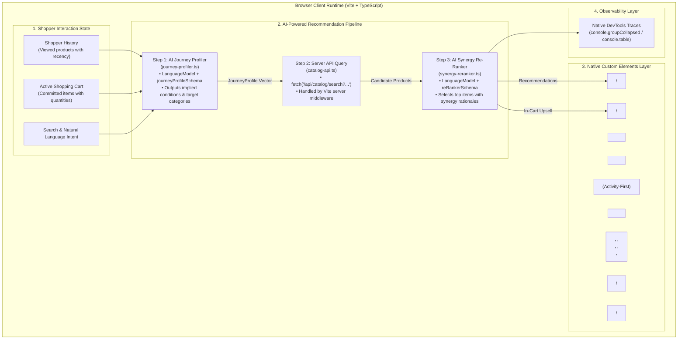

# Technical Specification: Mont-Royal Plein Air
## Modern Web Platform & On-Device AI Recommendation Architecture

---

## 1. System Architecture Overview

This project is a teaching reference implementation demonstrating how to build a **fast, private, on-device contextual recommendation engine** and multi-lingual outdoor outfitter storefront using modern web platform standards, **Chrome Built-in AI (Prompt API / LanguageModel & Translator API)**, and **Native Web Components**.

### 1.1 Core Architecture Principles
1. **Modern Web Standards First:** Built directly on baseline web platform primitives (`HTMLElement` Custom Elements, native `<dialog>` with Invoker Commands `commandfor` and `command`, `Intl.NumberFormat`, CSS Grid, Container Queries). No meta-frameworks or custom wrapper abstractions are used.
2. **Activity-First Navigation & Atomic Product Categories:** Top-level navigation and primary filtering pivot on **Activities** (*Backpacking*, *Camping*, *Hiking*, *Mountaineering*, *Paddling*, *Trail Running*). Product categories are **single-concept, atomic items** (*Tents*, *Shelters*, *Sleeping Bags*, *Pads*, *Backpacks*, *Dry Bags*, *Stoves*, *Cookware*, *Water Filters*, *Hydration*, *Headlamps*, *Lanterns*, *Jackets*, *Base Layers*, *Gloves*, *Boots*, *Shoes*, *First Aid*, *Navigation*). Products can belong to multiple categories and multiple activities.
3. **Single Source of Truth Constants:** All taxonomy constants (`CONDITIONS`, `ACTIVITIES`, `PRODUCT_CATEGORIES`) are declared once as `const` arrays in `src/catalog/dataset.ts` and directly reused in TypeScript union types and Prompt API JSON schemas without duplication.
4. **Streamlined, Teaching-Focused AI Architecture:** 
   - **Zero Boilerplate:** Prompt API interactions are isolated into small, self-contained single-purpose modules (`journey-profiler.ts` and `synergy-reranker.ts`) composed by a concise 3-step coordinator function (`recommendation-coordinator.ts`).
   - **No Heuristic Fallbacks:** The AI pipeline runs directly as specified.
   - **Structured Outputs (`responseConstraint`):** Uses the Prompt API's native `responseConstraint` schema configuration to guarantee structured JSON output.
5. **Universal Model Download Status Indicator:** A dedicated `<model-download-bar>` Custom Element monitors and visualizes download progress across both `LanguageModel` and `Translator` sessions using native `downloadprogress` events and accessible `aria-live="polite"` status announcements.
6. **Declarative DOM Translation Architecture:** The `TranslationService` integrates with a reactive `languageStore` that automatically coordinates translations for UI text and dynamic product details across custom elements.
7. **Strict Codebase Organization & Modularity:**
   - Library and utility files use strict `kebab-case` naming (`prompt-api.ts`, `journey-profiler.ts`, `synergy-reranker.ts`, `catalog-api.ts`).
   - Custom element component files use `PascalCase` (`ProductCard.ts`, `CartDrawer.ts`).
   - Every source file is strictly constrained to **under 350 lines of code**.
   - No unexpanded acronyms (e.g., `ProductView` and `<product-view>`, not "PDP").
   - Product image assets are stored flat in `public/images/catalog/*.webp`.



---

## 2. Directory Structure & Module Boundaries

```
montreal/
├── docs/
│   ├── PRD.md                           # Product Requirements Document
│   └── SPEC.md                          # This Technical Specification
├── mockups/
│   └── index.html                       # Reference UI Mockup
├── public/
│   ├── favicon.svg                      # Storefront Favicon
│   ├── icons.svg                        # SVG Icons
│   └── images/
│       └── catalog/                     # Flat directory of product images (all 75 items)
│           ├── taiga-down-minus10.webp
│           ├── gaspesie-2p-tent.webp
│           ├── laurentian-pad-r48.webp
│           └── ... (all 75 product assets)
├── src/
│   ├── ai/
│   │   ├── prompt-api.ts                # LanguageModel lifecycle, capability detection & session helper
│   │   ├── recommendation-schemas.ts    # JSON Schema definitions referencing dataset constants
│   │   ├── journey-profiler.ts          # Step 1: AI Journey Profiler (Prompt API)
│   │   ├── synergy-reranker.ts          # Step 3: AI Synergy Re-Ranker (Prompt API)
│   │   ├── recommendation-coordinator.ts# Clean 3-step recommendation pipeline orchestrator
│   │   └── translator.ts                # Translator API integration service
│   ├── catalog/
│   │   ├── dataset.ts                   # 75-item product catalog data, constants, and domain types
│   │   └── catalog-api.ts               # Client API service calling /api/catalog endpoints
│   ├── components/
│   │   ├── common/
│   │   │   └── ModelDownloadBar.ts      # <model-download-bar> Universal AI download indicator
│   │   ├── header/
│   │   │   ├── SiteHeader.ts            # <site-header> Top landmark container
│   │   │   ├── BrandLogo.ts             # <brand-logo> Brand emblem
│   │   │   ├── CategoryNav.ts           # <category-nav> Activity-first primary navigation
│   │   │   ├── SearchBar.ts             # <search-bar> Top search input
│   │   │   ├── CartButton.ts            # <cart-button> Cart invoker button
│   │   │   └── LanguagePicker.ts        # <language-picker> Language selector
│   │   ├── home/
│   │   │   ├── HeroBanner.ts            # <hero-banner> Hero presentation
│   │   │   ├── AdventureSearch.ts       # <adventure-search> Natural language discovery box
│   │   │   └── CategoryCard.ts          # <category-card> Home activity/category entry card
│   │   ├── facets/
│   │   │   ├── FacetSidebar.ts          # <facet-sidebar> Filter container
│   │   │   ├── FacetCategory.ts         # <facet-category> Multi-select category facet
│   │   │   ├── FacetActivity.ts         # <facet-activity> Multi-select activity facet
│   │   │   ├── FacetCondition.ts        # <facet-condition> Multi-select condition facet
│   │   │   ├── FacetWeight.ts           # <facet-weight> Multi-select weight facet
│   │   │   ├── FacetPrice.ts            # <facet-price> Multi-select price facet
│   │   │   └── FacetRating.ts           # <facet-rating> Multi-select rating facet
│   │   ├── catalog/
│   │   │   ├── ProductCard.ts           # <product-card> Semantic product card
│   │   │   └── ProductGrid.ts           # <product-grid> Responsive catalog grid
│   │   ├── product/
│   │   │   ├── ProductView.ts           # <product-view> Standalone Product Details Page
│   │   │   ├── BreadcrumbsNav.ts        # <breadcrumbs-nav> Hierarchical navigation
│   │   │   └── SpecsTable.ts            # <specs-table> Specifications table
│   │   ├── recommendations/
│   │   │   ├── ForYouStrip.ts           # <for-you-strip> Live region "For You" container
│   │   │   └── ForYouCard.ts            # <for-you-card> Recommendation card with quick-add
│   │   └── cart/
│   │       ├── CartDrawer.ts            # <cart-drawer> Native <dialog> with invoker commands
│   │       ├── CartItem.ts              # <cart-item> Line item with quantity adjustments
│   │       ├── CartSummary.ts           # <cart-summary> Subtotal, Quebec tax, and checkout CTA
│   │       └── ForYouUpsell.ts          # <for-you-upsell> In-cart recommendation tray
│   ├── observability/
│   │   └── devtools-trace.ts            # Chrome DevTools structured console logger
│   ├── state/
│   │   ├── cart-store.ts                # Reactive cart state store and item types
│   │   ├── filter-store.ts              # Reactive faceted filter state store
│   │   ├── history-store.ts             # Reactive browsing history store
│   │   ├── language-store.ts            # Reactive language selection store
│   │   └── model-status-store.ts        # Reactive model download status store
│   ├── utils/
│   │   └── formatters.ts                # Intl.NumberFormat currency and unit helpers
│   ├── main.ts                          # Single entry point registering elements & bootstrapping
│   └── style.css                        # Alpine Heritage design tokens and styles
├── index.html                           # Single-Page Application Host HTML
├── package.json                         # Package dependencies & scripts
├── tsconfig.json                        # Strict TypeScript configuration
└── vite.config.ts                       # Vite bundler with Catalog API middleware plugin
```

---

## 3. Co-located Domain Models & Full TypeScript Type System

### 3.1 Single Source of Truth Constants & Catalog Types (`src/catalog/dataset.ts`)

All taxonomy values are defined **once** as `const` arrays:

```typescript
/**
 * @file src/catalog/dataset.ts
 * @description Catalog dataset, taxonomy constants, and core product domain models.
 */

/**
 * Primary outdoor activities (main navigation and primary facet pivot).
 */
export const ACTIVITIES = [
  'Backpacking',
  'Camping',
  'Hiking',
  'Mountaineering',
  'Paddling',
  'Trail Running',
] as const;

export type ActivityType = (typeof ACTIVITIES)[number];

/**
 * Single-concept, atomic product categories across equipment lines.
 */
export const PRODUCT_CATEGORIES = [
  'Tents',
  'Shelters',
  'Sleeping Bags',
  'Pads',
  'Backpacks',
  'Dry Bags',
  'Stoves',
  'Cookware',
  'Water Filters',
  'Hydration',
  'Headlamps',
  'Lanterns',
  'Jackets',
  'Base Layers',
  'Gloves',
  'Boots',
  'Shoes',
  'First Aid',
  'Navigation',
] as const;

export type ProductCategory = (typeof PRODUCT_CATEGORIES)[number];

/**
 * Atomic, single-attribute composable weather and environmental conditions.
 */
export const CONDITIONS = [
  'Sub-Zero',
  'Cold',
  'Mild',
  'Hot',
  'Wet',
  'Icy',
  'Snowy',
  'Windy',
  'Dry',
] as const;

export type WeatherCondition = (typeof CONDITIONS)[number];

/**
 * Product domain entity within the 75-item catalog.
 */
export interface Product {
  readonly id: string;
  readonly name: string;
  /** An item can belong to multiple categories (e.g. dry sacks belong to Backpacks and Dry Bags). */
  readonly categories: readonly ProductCategory[];
  /** An item can serve multiple outdoor activities. */
  readonly activities: readonly ActivityType[];
  /** Composable environmental condition tags. */
  readonly conditions: readonly WeatherCondition[];
  /** Weight in exact grams for sorting and Intl.NumberFormat display. */
  readonly weight: number;
  /** Price in Canadian Dollars (CAD). */
  readonly price: number;
  readonly rating: number;
  readonly reviews: number;
  /** Narrative description of technical materials and construction. */
  readonly description: string;
  /** Key-value technical specifications. */
  readonly specs: Readonly<Record<string, string>>;
  /** Relative asset URL in public/images/catalog/. */
  readonly image: string;
}
```

### 3.2 State Store Types (`src/state/*.ts`)

```typescript
/**
 * @file src/state/cart-store.ts
 */
export interface CartItem {
  readonly productId: string;
  quantity: number;
}

/**
 * @file src/state/history-store.ts
 */
export interface HistoryEvent {
  readonly productId: string;
  readonly timestamp: number;
}

/**
 * @file src/state/filter-store.ts
 */
export type WeightBracket = '<500' | '500-1000' | '1000-2000' | '>2000';
export type PriceBracket = '<50' | '50-100' | '100-250' | '>250';

export interface FilterState {
  readonly categories: ReadonlySet<ProductCategory>;
  readonly activities: ReadonlySet<ActivityType>;
  readonly conditions: ReadonlySet<WeatherCondition>;
  readonly weights: ReadonlySet<WeightBracket>;
  readonly prices: ReadonlySet<PriceBracket>;
  readonly minRatings: ReadonlySet<number>;
  readonly query: string;
}

/**
 * @file src/state/model-status-store.ts
 */
export interface ModelStatus {
  readonly isDownloading: boolean;
  readonly progressPercent: number;
  readonly modelName: string;
  readonly message: string;
}

/**
 * @file src/state/language-store.ts
 */
export type SupportedLanguage = 'en' | 'fr' | 'es' | 'de';
```

---

## 4. Server API Architecture (Vite Connect Middleware)

`vite.config.ts` incorporates `catalogServerPlugin` to serve `/api/catalog/search` and `/api/catalog/products/:id` with real HTTP responses:

```typescript
/**
 * @file vite.config.ts
 * @description Vite configuration with custom Catalog Server API middleware plugin.
 */

import { defineConfig, type Plugin } from 'vite';
import { CATALOG } from './src/catalog/dataset';

function catalogServerPlugin(): Plugin {
  return {
    name: 'catalog-server-api',
    configureServer(server) {
      server.middlewares.use('/api/catalog/search', (req, res) => {
        const url = new URL(req.url || '', `http://${req.headers.host}`);
        const categories = url.searchParams.getAll('categories');
        const activity = url.searchParams.get('activity');
        const conditions = url.searchParams.getAll('conditions');
        const exclude = url.searchParams.getAll('exclude');
        const limit = parseInt(url.searchParams.get('limit') || '15', 10);

        let results = CATALOG.filter(item => !exclude.includes(item.id));

        if (categories.length > 0) {
          results = results.filter(item => item.categories.some(c => categories.includes(c)));
        }
        if (activity) {
          results = results.filter(item => item.activities.includes(activity as any));
        }
        if (conditions.length > 0) {
          results = results.filter(item => item.conditions.some(c => conditions.includes(c as any)));
        }

        res.setHeader('Content-Type', 'application/json');
        res.end(JSON.stringify(results.slice(0, limit)));
      });

      server.middlewares.use('/api/catalog/products', (req, res) => {
        const id = (req.url || '').replace(/^\//, '').split('?')[0];
        const product = CATALOG.find(p => p.id === id);
        res.setHeader('Content-Type', 'application/json');
        if (product) {
          res.end(JSON.stringify(product));
        } else {
          res.statusCode = 404;
          res.end(JSON.stringify({ error: 'Product not found' }));
        }
      });
    },
  };
}

export default defineConfig({
  plugins: [catalogServerPlugin()],
});
```

Client queries in `src/catalog/catalog-api.ts` call this endpoint directly via `fetch()`:

```typescript
/**
 * @file src/catalog/catalog-api.ts
 * @description Client service calling the backend /api/catalog endpoints.
 */

import type { Product, ProductCategory, ActivityType, WeatherCondition } from './dataset';

export interface CatalogQueryParams {
  readonly categories?: readonly ProductCategory[];
  readonly activity?: ActivityType;
  readonly conditions?: readonly WeatherCondition[];
  readonly excludeProductIds?: readonly string[];
  readonly limit?: number;
}

export class CatalogApiService {
  public async queryCandidates(params: CatalogQueryParams): Promise<readonly Product[]> {
    const searchParams = new URLSearchParams();
    params.categories?.forEach(c => searchParams.append('categories', c));
    if (params.activity) searchParams.set('activity', params.activity);
    params.conditions?.forEach(c => searchParams.append('conditions', c));
    params.excludeProductIds?.forEach(id => searchParams.append('exclude', id));
    if (params.limit) searchParams.set('limit', String(params.limit));

    try {
      const response = await fetch(`/api/catalog/search?${searchParams.toString()}`);
      if (!response.ok) throw new Error(`Catalog API returned ${response.status}`);
      return (await response.json()) as Product[];
    } catch {
      return [];
    }
  }

  public async getProductById(id: string): Promise<Product | null> {
    try {
      const response = await fetch(`/api/catalog/products/${encodeURIComponent(id)}`);
      if (!response.ok) return null;
      return (await response.json()) as Product;
    } catch {
      return null;
    }
  }
}

export const catalogApi = new CatalogApiService();
```

---

## 5. Streamlined, Teaching-Focused AI Recommendation Engine

### 5.1 JSON Schemas (`src/ai/recommendation-schemas.ts`)

Directly references the single-source-of-truth constants from `dataset.ts`:

```typescript
/**
 * @file src/ai/recommendation-schemas.ts
 * @description Strict JSON Schemas referencing dataset constants for responseConstraint.
 */

import { CONDITIONS, ACTIVITIES, PRODUCT_CATEGORIES } from '../catalog/dataset';

export const journeyProfileSchema = {
  type: 'object',
  properties: {
    impliedConditions: {
      type: 'array',
      items: {
        type: 'string',
        enum: CONDITIONS,
      },
    },
    primaryActivity: {
      type: 'string',
      enum: ACTIVITIES,
    },
    targetCategories: {
      type: 'array',
      items: {
        type: 'string',
        enum: PRODUCT_CATEGORIES,
      },
    },
    equipmentRationale: { type: 'string' },
  },
  required: ['impliedConditions', 'primaryActivity', 'targetCategories', 'equipmentRationale'],
};

export const reRankerSelectionSchema = {
  type: 'object',
  properties: {
    recommendations: {
      type: 'array',
      items: {
        type: 'object',
        properties: {
          id: { type: 'string' },
          synergyRationale: { type: 'string' },
        },
        required: ['id', 'synergyRationale'],
      },
    },
  },
  required: ['recommendations'],
};
```

---

### 5.2 Step 1: AI Journey Profiler (`src/ai/journey-profiler.ts`)

A focused, single-purpose module extracting the user's intent:

```typescript
/**
 * @file src/ai/journey-profiler.ts
 * @description Step 1: Synthesizes shopper intent into a structured JourneyProfile.
 */

import { promptAPIManager } from './prompt-api';
import { journeyProfileSchema } from './recommendation-schemas';
import type { WeatherCondition, ActivityType, ProductCategory, Product } from '../catalog/dataset';

export const JOURNEY_PROFILER_SYSTEM_PROMPT = `
You are the Technical Outfitting Director for Mont-Royal Plein Air.
Analyze the shopper's interaction history and active shopping cart.
Synthesize the implied weather conditions, primary outdoor activity, target complementary product categories, and a 1-sentence pairing rationale.
`.trim();

export interface JourneyProfile {
  readonly impliedConditions: readonly WeatherCondition[];
  readonly primaryActivity: ActivityType;
  readonly targetCategories: readonly ProductCategory[];
  readonly equipmentRationale: string;
}

export interface ProfilerInputContext {
  readonly history: readonly { productId: string; timestamp: number }[];
  readonly cart: readonly { productId: string; quantity: number }[];
  readonly currentProductId: string | null;
  readonly prompt?: string;
}

export async function inferJourneyProfile(
  context: ProfilerInputContext,
  catalogMap: ReadonlyMap<string, Product>
): Promise<JourneyProfile> {
  const session = await promptAPIManager.getSession(JOURNEY_PROFILER_SYSTEM_PROMPT);

  const viewedDetails = context.history
    .map(h => catalogMap.get(h.productId))
    .filter((p): p is Product => p !== undefined)
    .map(p => `[Viewed] ${p.name} | Cat: ${p.categories.join('/')} | Cond: ${p.conditions.join('/')}`)
    .join('\n');

  const cartDetails = context.cart
    .map(c => {
      const p = catalogMap.get(c.productId);
      return p ? `[Cart x${c.quantity}] ${p.name} | Cat: ${p.categories.join('/')}` : '';
    })
    .filter(Boolean)
    .join('\n');

  const promptText = `
SHOPPER HISTORY:
${viewedDetails || 'None'}

ACTIVE CART (3.0x INTENT):
${cartDetails || 'Empty'}

TRIP INTENT: ${context.prompt || 'None specified'}
`.trim();

  const rawJson = await session.prompt(promptText, {
    responseConstraint: journeyProfileSchema,
  });
  session.destroy();

  return JSON.parse(rawJson) as JourneyProfile;
}
```

---

### 5.3 Step 3: AI Synergy Re-Ranker (`src/ai/synergy-reranker.ts`)

A focused module selecting top companion items with rationales:

```typescript
/**
 * @file src/ai/synergy-reranker.ts
 * @description Step 3: Evaluates candidate products and selects top companion gear with rationales.
 */

import { promptAPIManager } from './prompt-api';
import { reRankerSelectionSchema } from './recommendation-schemas';
import type { Product } from '../catalog/dataset';
import type { JourneyProfile } from './journey-profiler';

export const RE_RANKER_SYSTEM_PROMPT = `
You are the Technical Outfitting Director for Mont-Royal Plein Air.
Select 2 to 4 products from the candidate list that offer the highest functional, thermal, or physical synergy with the shopper's active journey and cart.
Items in the active cart have 3.0x higher priority than browsing history items.
Provide a 1-sentence technical synergy explanation for each recommended product.
`.trim();

export interface RecommendedItem {
  readonly product: Product;
  readonly synergyRationale: string;
}

export async function rankComplementaryGear(
  profile: JourneyProfile,
  candidates: readonly Product[],
  limit: number = 3
): Promise<readonly RecommendedItem[]> {
  const session = await promptAPIManager.getSession(RE_RANKER_SYSTEM_PROMPT);

  const candidateList = candidates
    .map(c => `- ID: "${c.id}" | ${c.name} | Cat: ${c.categories.join('/')} | Act: ${c.activities.join('/')} | Wt: ${c.weight}g | Price: $${c.price} | Specs: ${c.description}`)
    .join('\n');

  const promptText = `
JOURNEY RATIONALE: ${profile.equipmentRationale}
IMPLIED CONDITIONS: ${profile.impliedConditions.join(', ')}
PRIMARY ACTIVITY: ${profile.primaryActivity}

CANDIDATES:
${candidateList}
`.trim();

  const rawJson = await session.prompt(promptText, {
    responseConstraint: reRankerSelectionSchema,
  });
  session.destroy();

  const parsed = JSON.parse(rawJson) as {
    recommendations: { id: string; synergyRationale: string }[];
  };

  const results: RecommendedItem[] = [];
  for (const rec of parsed.recommendations) {
    const product = candidates.find(c => c.id === rec.id);
    if (product) {
      results.push({ product, synergyRationale: rec.synergyRationale });
    }
    if (results.length >= limit) break;
  }

  return results;
}
```

---

### 5.4 Recommendation Pipeline Coordinator (`src/ai/recommendation-coordinator.ts`)

A clean, 3-step orchestrator without complexity or boilerplate:

```typescript
/**
 * @file src/ai/recommendation-coordinator.ts
 * @description Orchestrates the 3-step AI recommendation pipeline.
 */

import { inferJourneyProfile, type ProfilerInputContext } from './journey-profiler';
import { catalogApi } from '../catalog/catalog-api';
import { rankComplementaryGear, type RecommendedItem } from './synergy-reranker';
import { logDevToolsTrace } from '../observability/devtools-trace';
import type { Product } from '../catalog/dataset';

export class RecommendationCoordinator {
  public async getRecommendations(
    context: ProfilerInputContext,
    catalogMap: ReadonlyMap<string, Product>,
    limit: number = 3
  ): Promise<readonly RecommendedItem[]> {
    // Step 1: AI Journey Profiler (LanguageModel + journeyProfileSchema)
    const profile = await inferJourneyProfile(context, catalogMap);

    // Step 2: Catalog API Query (fetch('/api/catalog/search?...'))
    const candidates = await catalogApi.queryCandidates({
      categories: profile.targetCategories,
      activity: profile.primaryActivity,
      conditions: profile.impliedConditions,
      excludeProductIds: [
        ...(context.currentProductId ? [context.currentProductId] : []),
        ...context.cart.map(c => c.productId),
      ],
      limit: 15,
    });

    // Step 3: AI Synergy Re-Ranker (LanguageModel + reRankerSelectionSchema)
    const recommendations = await rankComplementaryGear(profile, candidates, limit);

    // Log structured trace to DevTools console
    logDevToolsTrace({ context, profile, candidates, recommendations });

    return recommendations;
  }
}

export const recommendationCoordinator = new RecommendationCoordinator();
```

---

## 6. Declarative DOM Translation Architecture

When the user selects a language in `<language-picker>`, translation is handled transparently across the application:

```mermaid
flowchart LR
    LP["<language-picker>"] -->|setLanguage('fr')| LS["languageStore"]
    LS -->|triggers| TS["translationService (Translator API)"]
    TS -->|emits downloadprogress| MDB["<model-download-bar>"]
    LS -->|notifies components| COMP["Custom Elements<br/>(<product-card>, <product-view>, etc.)"]
    COMP -->|translate dynamic text| TS
```

1. **`languageStore`:** Holds active language state (`'en' | 'fr' | 'es' | 'de'`).
2. **`translationService` (`src/ai/translator.ts`):** Manages `globalThis.Translator` sessions, monitoring download progress via `modelStatusStore`.
3. **Component Integration:** Custom elements re-render on language change, translating dynamic product titles, descriptions, and specifications on the fly using `translationService.translateText()`.

---

## 7. Universal Model Download Status Indicator Component

```typescript
/**
 * @file src/components/common/ModelDownloadBar.ts
 * @description Universal indicator displaying background model and language pack downloads.
 */

import { modelStatusStore } from '../../state/model-status-store';

export class ModelDownloadBar extends HTMLElement {
  private unsubscribe: (() => void) | null = null;

  public connectedCallback(): void {
    this.render();
    this.unsubscribe = modelStatusStore.subscribe(() => this.render());
  }

  public disconnectedCallback(): void {
    this.unsubscribe?.call(null);
  }

  private render(): void {
    const status = modelStatusStore.getStatus();

    if (!status.isDownloading) {
      this.innerHTML = '';
      this.classList.remove('active');
      return;
    }

    this.classList.add('active');
    this.innerHTML = `
      <div 
        class="model-download-banner" 
        role="status" 
        aria-live="polite" 
        aria-label="AI Model Download Status"
      >
        <div class="model-download-info">
          <span class="model-spinner" aria-hidden="true">⚙️</span>
          <span class="model-text">${status.message} (${status.progressPercent}%)</span>
        </div>
        <progress 
          class="model-progress-bar" 
          value="${status.progressPercent}" 
          max="100" 
          aria-valuenow="${status.progressPercent}" 
          aria-valuemin="0" 
          aria-valuemax="100"
        ></progress>
      </div>
    `;
  }
}

customElements.define('model-download-bar', ModelDownloadBar);
```

---

## 8. Native `<dialog>` Cart Drawer with Invoker Commands

```typescript
/**
 * @file src/components/cart/CartDrawer.ts
 * @description Native <dialog> Cart Drawer with Invoker Commands.
 */

import { cartStore } from '../../state/cart-store';

export class CartDrawer extends HTMLElement {
  private unsubscribe: (() => void) | null = null;

  public connectedCallback(): void {
    this.innerHTML = `
      <dialog id="cart-dialog" class="cart-dialog" aria-labelledby="cart-heading">
        <div class="cart-dialog-inner">
          <header class="cart-header">
            <h2 id="cart-heading">Your Cart (<span id="cart-count-display">0</span>)</h2>
            <button 
              commandfor="cart-dialog" 
              command="close" 
              class="cart-close-btn" 
              aria-label="Close Shopping Cart"
            >✕</button>
          </header>
          <div class="cart-items-container" id="cart-items-list">
            <!-- <cart-item> elements rendered here -->
          </div>
          <for-you-upsell></for-you-upsell>
          <cart-summary></cart-summary>
        </div>
      </dialog>
    `;

    this.unsubscribe = cartStore.subscribe(() => this.updateCartItems());
  }

  public disconnectedCallback(): void {
    this.unsubscribe?.call(null);
  }

  private updateCartItems(): void {
    const items = cartStore.getItems();
    const countDisplay = this.querySelector('#cart-count-display');
    if (countDisplay) {
      countDisplay.textContent = String(cartStore.getTotalQuantity());
    }

    const container = this.querySelector('#cart-items-list');
    if (!container) return;

    if (items.length === 0) {
      container.innerHTML = '<p class="cart-empty-message">Your gear bag is empty.</p>';
      return;
    }

    container.innerHTML = items
      .map(item => `<cart-item product-id="${item.productId}" quantity="${item.quantity}"></cart-item>`)
      .join('');
  }
}

customElements.define('cart-drawer', CartDrawer);
```

---

## 9. Verification & Quality Assurance Plan

### 9.1 Automated Type & Build Verification
```bash
# Verify all types and syntax with strict TypeScript compiler
pnpm run build

# Start local development server with Vite catalog API plugin
pnpm run dev --port 5173
```

### 9.2 In-Browser Verification Steps
1. **Invoker Commands:** Verify clicking `<cart-button commandfor="cart-dialog" command="show-modal">` opens the `<dialog>` and `<button commandfor="cart-dialog" command="close">` dismisses it.
2. **Server API Query:** Verify `fetch('/api/catalog/search?activity=Backpacking&limit=15')` returns real JSON from the Vite connect middleware.
3. **3-Step AI Recommendation Pipeline:** Verify Step 1 (Journey Synthesis) $\to$ Step 2 (Catalog Query API) $\to$ Step 3 (AI Synergy Re-Ranking with `responseConstraint`) executes smoothly and logs structured traces to DevTools console.
4. **Universal Download Indicator:** Verify `<model-download-bar>` displays real progress when LanguageModel or Translator models are downloaded.
5. **Activity-First Navigation & Atomic Categories:** Verify navigation shows Activities (*Backpacking*, *Camping*, etc.) and products appear across relevant single-concept categories (*Tents*, *Pads*, *Stoves*, etc.).
6. **No Acronyms & Line Limits:** Verify all files remain strictly under 350 lines of code with zero acronym naming.
